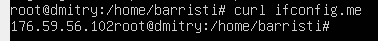
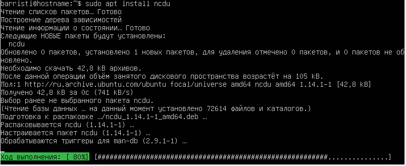

# Project Linux.

## Установка ОС

 Изначально назвал машину rootdudu, но позже возникли проблемы пришлось переделать на barristi.

Вывод команды cat /etc/issue

## Создание пользователя

Команда для создания пользователя

Вывод команды cat /etc/passwd

## Настройка сети

Установи временную зону, соответствующую твоему текущему местоположению.

Вывод названия сетевых интерфейсов с помощью консольной команды.

Loopback — это термин, который обычно используется для описания методов или процедур маршрутизации электронных сигналов, цифровых потоков данных, или других движущихся сущностей от их источника и обратно к тому же источнику без специальной обработки или модификаций. Первоначально он использовался для тестирования передачи или передающей инфраструктуры.

Используя консольную команду, получи ip адрес устройства от DHCP сервера.

DHCP — протокол прикладного уровня модели TCP/IP, служит для назначения IP-адреса клиенту. Это следует из его названия — Dynamic Host Configuration Protocol. IP-адрес можно назначать вручную каждому клиенту, то есть компьютеру в локальной сети.

Определи и выведи на экран внешний ip-адрес шлюза (ip)

Внутренний IP-адрес шлюза, он же ip-адрес по умолчанию (gw).

Задал новые статичные настройки так как сетевое взаимодействие контролируется функцией Netplan. 

С помощью nano задал новую конфигурацию для Netplan в файл 00-installet-config.yaml
 

Cтатичные настройки ip, gw, dns после перезагрузки.

## Обновление ОС

## Использование команды sudo

sudo (англ. Substitute User and do, дословно «подменить пользователя и выполнить») — программа для системного администрирования UNIX-систем, позволяющая делегировать те или иные привилегированные ресурсы пользователям с ведением протокола работы.

## Установка и настройка службы времени
Для того что бы настроить службу времени достаточно прописать 
"sudo dpkg-reconfigure tzdata" после чего мы проваливаемся в меню настройки.

### Вывод команды.

## Установка и использование текстовых редакторов

Установка текстовых редакторов:

для выхода с сохранением ESC, :wq

для сохранения с выходом ctrl+o -> enter -> ctrl+x
Ctrl+W	Поиск назад от курсора 
alt+r замена найденого вырожения

ctrl+K+W сохранение выделенного блока в виде файла ctrl+c для выхода

для поиска ctrl+g вводим что искать

для замены выбираем соответствующий пункт в меню, и прописываем на что меняем 

## Установка и базовая настройка сервиса SSHD

ps aux: 
a = показать процессы для всех пользователей
u = отобразить пользователя/владельца процесса
x = также показать процессы, не подключенные к терминалу

### Netstat -tan выводит информацию о сетевых сокетах, активных соединениях и маршрутизации. 

Значение 0.0.0.0 означает, что сокет привязан к любому адресу и порту на локальном компьютере. Это полезно для серверов, которые должны быть доступны с любого сетевого интерфейса.

-t указывает на то, что нужно вывести текущее подключение
-a включает отображение всех активных подключений и ожидающих портов.
-n указывает на то, что нужно выводить адреса и номера портов в числовом формате

## Установка и использование утилит top, htop
По выводу команды top:
uptime, количество авторизованных пользователей,среднюю загрузку системы,
общее количество процессов, загрузку cpu,загрузку памяти:

>pid процесса занимающего больше всего памяти,

>pid процесса, занимающего больше всего процессорного времени.

отсортированному по 
>PID

>PERCENT_CPU

>PERCENT_MEM

>TIME

>отфильтрованному для процесса sshd

>с процессом syslog, найденным, используя поиск

>с добавленным выводом hostname, clock и uptime

## Использование утилиты fdisk

Команда fdisk -l

название жесткого диска /dev/sda
размер = 25 gb
количество секторов = 26843545600
размер swap = 2 gb

## Использование утилиты df

Запустить команду df. В отчёте написать для корневого раздела
размер раздела - 11758760
размер занятого пространства - 4872680;
размер свободного пространства - 6266972 ;
процент использования - 44%

Запустить команду df -Th.
В отчёте написать для корневого раздела 
размер раздела - 12;
размер занятого пространства - 4.7;
размер свободного пространства - 6.0G;
процент использования - 44%

## Использование утилиты du

Запустить команду du.
Вывести размер папок /home, /var, /var/log (в байтах)

размер всего содержимого в /var/log

## Установка и использование утилиты ncdu

Установка утилиты ncdu

Вывод размера папок:
/home

/var

/var/log

## Работа с системными журналами

dmesg

syslog

auth

время последней успешной авторизации-Aug 18 17:23:29
имя пользователя - hostname
метод входа в систему-sudo
Перезапустить службу SSHd.

## Использование планировщика заданий CRON

B системных журналах строчки (минимум две в заданном временном диапазоне) о выполнении.

список текущих заданий для CRON.

Удали все задания из планировщика заданий.

